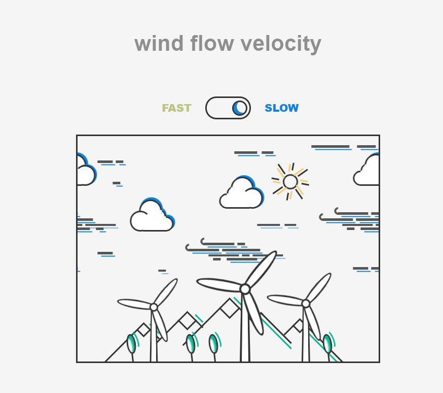

# 说明

主要使用html+css （小部分js）制作的风景动画


---  **效果展示**





-- **陌生概念**

**vmin**

 `vmin`——取`vw`和`vh`中较小的一个为基准，和`vmax`——取`vw`和`vh`中较大的一个为基准 

**去除after before 元素cursor：pointer;效果**

```css
cursor: inherit;
pointer-events: none;
```

**css 变量使用**

```css
transform: rotate(calc(var(--i) * 45deg )) translateX(-20px)

<span style="--i:1"></span>
<span style="--i:2"></span>

animation-delay: calc(var(--i) * -0.5s);
```

**Emment** 

` *(span[style=--i:$])\*8*`


**vscode快捷键**

alt + 鼠标左键 或 鼠标中键    可以多行输出

ctrl+shift + 左右方向键    可以添加或去掉选择的字符


**动画快速切换**

```css
.windmill .head{
  position: absolute;
  width: 10px;
  height: 10px;
  top: 0;
  transform: translateY(-50%);
  display: flex;
  justify-content: center;
  align-items: center;
  animation: fan-rotate 4s linear infinite;
  animation-play-state: paused;
}

.slow .windmill .head{
  animation-play-state: running;
}

.windmill .head .fan{
  position: absolute;
  width: 10px;
  height: 10px;
  top: 0;
  transform: translateY(-50%);
  display: flex;
  justify-content: center;
  align-items: center;
  animation: fan-rotate 2s linear infinite;
  animation-play-state: running;
}
.slow .windmill .head .fan{
  animation-play-state: paused;
}
```

​		一般是由内外两个div class 结构，默认是slow 内部fan类动画状态切换为running，添加slow class时，  最外层head类 `animation-play-state: running`，最里层fan暂停